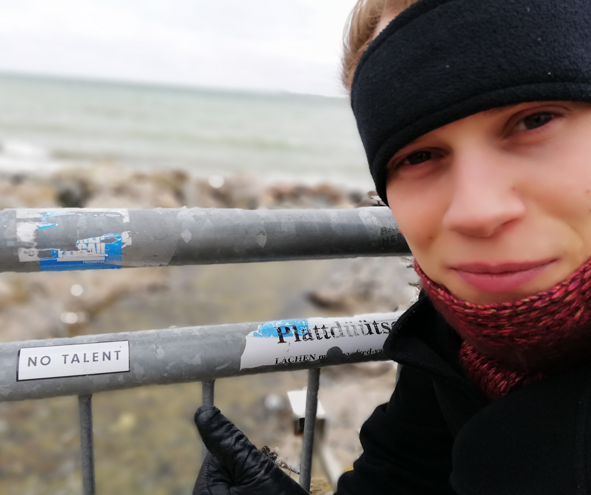

% Initial Thesis Ponderings
% Rasmus Diederichsen
% 2018-05-11

# Who is he?

* Cognitive Science BSc.
    - Good if you have no idea what to do
    - Symbolic AI, Neuroinformatics, Neuroscience, Philosophy (yikes)
    - Grossly engorged CS curriculum
    - Thesis: Failed attempt at leveraging image processing to retrieve viewpoint from historic images on an iPad
* Aspiring Computer Science MSc.
    - Robotics
    - Algorithms
    - Machine Learning/Vision

# What does he like?
* Frontend vs. Backend: **backend**
* Vim vs. Emacs: **vim**
* Tabs vs. Spaces: **spaces** (fight me)
* Dynamic vs. Static: **undecided**
* Clean code
* Documentation (<3 sphinx)
* Bike Maintenance 🚴

# What doesn't he like?
* Web programming

------------------------------------

# Project goals
Create an open source live monitoring framework for deep neural networks.

## Engineering perspective
In an ideal world, the following requirements would be met:

* Be agnostic to Pytorch and TF/Keras
* Provide a platform for easy experimentation with arbitrary diagnostics
* Enable live monitoring/insights as well as explanation for model predictions
* Build on top of Tensorboard
* Bring to life in Peltarion platform

Risk:

There's many packages and proposals for visualizations already. Engeneering aspect of project:
    **reimplement or port useful ones into cohesive framework with minimal intrusion to programmer
    workflow**

## Research perspective
In the same ideal world, the following questions would be answered:

* Which signals can be computed from model parameters/layers/dynamics to
  determine
    - Quality of initializations (did we hit a bad local optimum?)
    - Quality of Architecture for task (too limited, too powerful?)
    - if this layer can stop training
    - if the whole network can stop training
    - If the learning rate should be modified
* What is an appropriate statistical framework for investigation such
  correlations (**???**)

------------------------------------

# What has he done?

So far, I've

* skimmed a few explanation papers (LIME, influence functions)
* skimmed many more visualization publications (grad-cam, heatmapping)
* passively absorbed some ideas from Tishby's information bottleneck theory
  (status unclear)
* Started learning Pytorch by programming myself into a corner
    - Turns out my toy framework wouldn't live up to my plans -> **rebase onto
      ``tensorboard-pytorch``**
* Compiled notes to distill into roadmap

------------------------------------

# Goals for this visit
* Get to know people and products
* Pick platform brains
	- What visualizations/introspections exist or are planned?
	- (How) can I interface with the backend platform?
	- what would you like from an introspection toolbox?

------------------------------------

# Idea junkyard
## Detecting bad initializations
* Monitor Jacobian determinant and singular values of layer function (w.r.t. prev layer, c.f. Gloro init paper)
* Inject prior knowledge about e.g. image feature extractors (if they don't converge to edges, maybe they're stuck)

## Architectural Problems
* Activation eigenspace analysis (cue Justin)
* Monitor sparsity of encodings/detect correlations

## Saturation
* Tishby hinted that his info bottleneck theory could help detect layer saturation (where did I read this?)
* Monitor ratio between weights and updates

## Learning rate issues
* Monitor variance in weight updates

## Prediction explanation
* Port influence functions to pytorch
* Or adapt TF implementation

